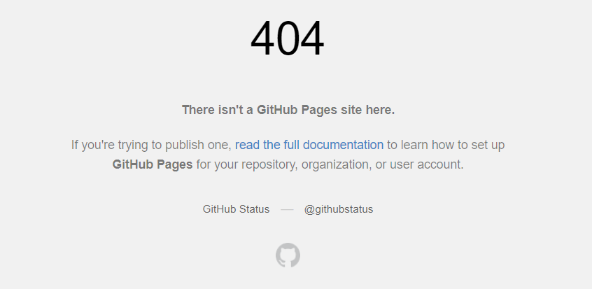
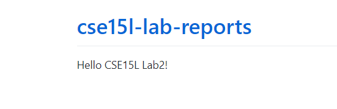

## CSE15L Lab2
# Basic Syntax

Welcome to **CSE15L** *Lab 2*!

Here is my [new GitHub Page](https://jypipi.github.io/cse15l-lab-reports/)

Screenshot:



> Oops! 404 Error!

* One minute

- Two minutes

3. Three minutes

4) Four minutes

5. Five minutes

---
Try again!
`https://jypipi.github.io/cse15l-lab-reports/`



```
# Code block
print("Hello World!")
System.out.println("Hello World!");
```

New Changes via VS Code
```
# VS Code
print("Hello World again!")
System.out.println("Hello World again!");
```
Way 1:
[Lab Report 1](lab-report-1-week-2.html)

Way 2:
[Lab Report 1](https://jypipi.github.io/cse15l-lab-reports/lab-report-1-week-2.html)
