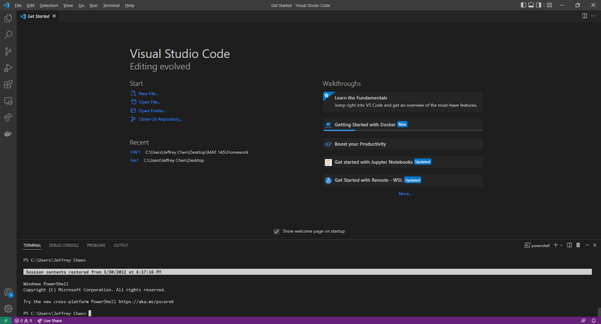
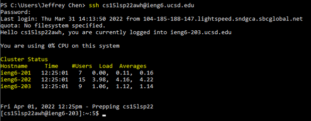
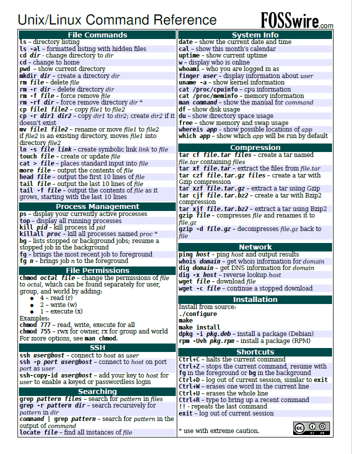
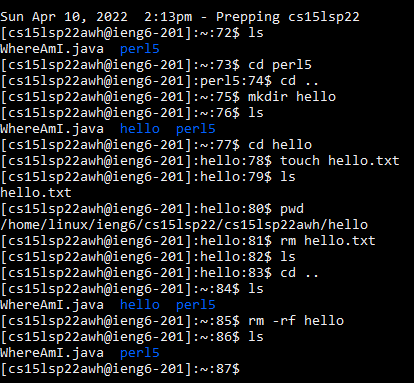
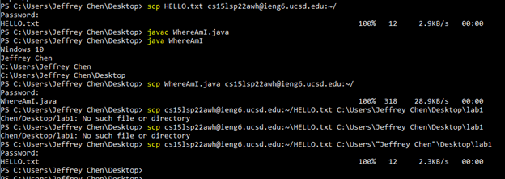
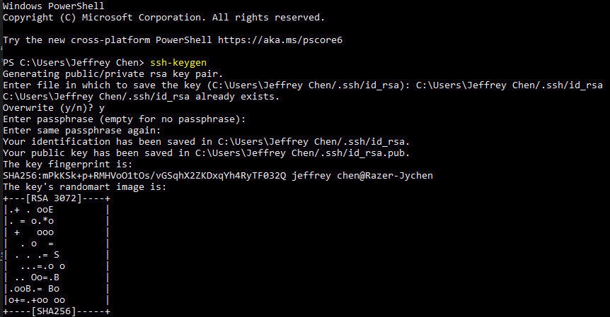
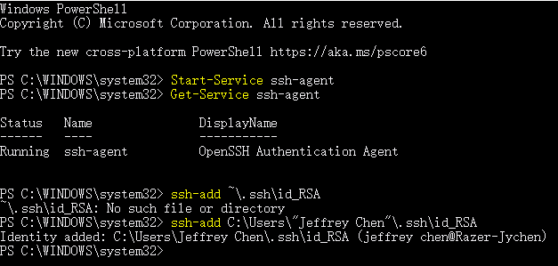
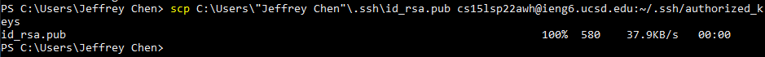
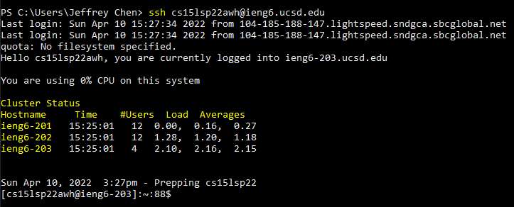
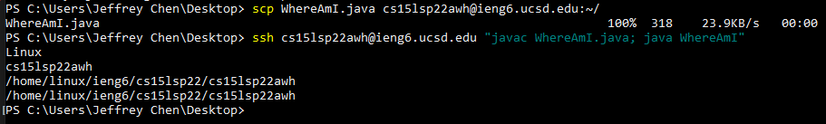

# Week 2: Lab Report 1

## Remote Access

Hello folks!

This tutorial page is going to demonstrate how to set up your computers, log into a remote server via SSH protocol, and use commands to complete certain tasks.

## Installing VScode

Follow the instructions on the [Visual Studio Code Website](https://code.visualstudio.com/) to install the IDE software on your computer:

1. Choose the correct version based on your OS such as macOS and Windows.
2. Download and follow the instructions to complete the installation.
3. After completing these steps, you will get the following window when openning VScode:



**Congratulations!** You get the first step done! Let's move on to the next topic.

## Remotely Connecting

In CSE 15L, you will be given a course-specific account on ieng6, and then you can log into this account by connecting to a remote server over the Internet.

* To enable SSH, you need to [install OpenSSH](https://docs.microsoft.com/en-us/windows-server/administration/openssh/openssh_install_firstuse) first.

```
#  (Steps for Windows are provided here)
# Open a PowerShell
$ Get-WindowsCapability -Online | Where-Object Name -like 'OpenSSH*'

# Install the OpenSSH Client
$ Add-WindowsCapability -Online -Name OpenSSH.Client~~~~0.0.1.0

# Install the OpenSSH Server
$ Add-WindowsCapability -Online -Name OpenSSH.Server~~~~0.0.1.0
```

After you [look up your account for CSE 15L](https://sdacs.ucsd.edu/~icc/index.php), you can try connecting to the remote server:

```
# Open a terminal
$ ssh cs15lsp22xxx@ieng6.ucsd.edu
```
* Replace the "xxx" with the three letters assigned to you.
* Follow the instructions on the terminal to continue.

After entering your password, now you should be able to login to your account:



## Trying Some Commands
Here is a [summary of Linux commands](https://files.fosswire.com/2007/08/fwunixref.pdf):



> Let's try some useful and regularly used commands:

```
# directory listing
$ ls

# open a folder
$ cd perl5

# Return to the parent folder
$ cd ..

# Create a new folder
$ mkdir hello

# Create a new file
$ touch hello.txt

# Show current directory
$ pwd

# Delete a file
$ rm hello.txt

# Delete a directory
$ rm -rf hello
```

The below image shows what I tried and the outcomes:



To disconnect to the remote host, try:
```
# Equivalent to Ctrl + D
$ exit
```

## Moving Files with `scp` Command
We' ve tried running some useful commands on the terminal, and now we are going to try another important function: transfer files between remote and local hosts via `scp` command.

* Transfer file from local to remote host:
```
# On local host
$ scp <FileName.xxx> cs15lsp22awh@ieng6.ucsd.edu:~/<Target Directory>
```

* Transfer file from remote to local host:
```
# On local host
$ scp cs15lsp22awh@ieng6.ucsd.edu:~/<FileName.xxx> C:\Users\”Jeffrey Chen”\Desktop
```

As shown in the below image, I tried:
1. Copy HELLO.txt from local to remote host.
2. Compile and run the file WhereAmI.java locally.
3. Copy WhereAmI.java from local to remote host.
4. Copy HELLO.txt back from remote to local host.
> Notes: Use backslash for Windows directory and forward slash for Linux directory.



Now, we're able to successfully transfer files between local and remote hosts!

## Setting an SSH Key
As you may see in the above steps, password is often needed when we perform some tasks with a terminal. Thus, if we can avoid repetitively typing the password, we can save much time in the future. The solution is SSH keys, which creates a pair of files called *public key* and *private key* to help us skip entering password.

> Here're the steps to set up SSH keys:
```
# On local host
$ ssh-keygen

# When you're asked to enter passphrase, hit enter only
```

* For Windows only, do the extra `ssh-add` steps:

* [Reference: More information here](https://docs.microsoft.com/en-us/windows-server/administration/openssh/openssh_keymanagement#user-key-generation)

```
# Run a PowerShell as an Administrator

# By default the ssh-agent service is disabled. Allow it to be manually started for the next step to work.
$ Get-Service ssh-agent | Set-Service -StartupType Manual

# Start the service
$ Start-Service ssh-agent

# Return a status of Running
$ Get-Service ssh-agent

# Now load your key files into ssh-agent
$ ssh-add ~\.ssh\id_<YOUR KEY FILE>
```

* Now copy the *public key* to the `.ssh` directory on the remote server:

```
# Open a terminal
$ ssh cs15lsp22xxx@ieng6.ucsd.edu
$ mkdir .ssh
$ exit

# On local host
$ scp /Users/<user-name>/.ssh/id_rsa.pub cs15lsp22xxx@ieng6.ucsd.edu:~/.ssh/authorized_keys
```
> Here's what I did to perform the above steps (Windows OS) :
* On local host: open PowerShell #1

* PowerShell #2: Run as an Administrator

* Go back to PowerShell #1


Now you should be able to `ssh` and `scp` from this local host to the remote server without password.



## Optimizing Remote Running
In this section, we use what we've learned to optimize the process for editting a file locally (e.g. WhereAmI.java), copying it to the remote server, and running it.

```
# Copy the file to remote host
$ scp WhereAmI.java cs15lsp22awh@ieng6.ucsd.edu:~/

# Run it on remote host
$ ssh cs15lsp22awh@ieng6.ucsd.edu "javac WhereAmI.java; java WhereAmI"
```

In this way, we can complete the task with only two commands:
1. Copy the file to remote host.
2. Log into the remote host and then run the file.
3. Disconnect to the remote host.



# Conclusion

Congratulations! We make it!

Today, we covered multiple topics related to important system setup and basic Linux commands for future study.

1) VScode Installation
2) Remote Connection
3) Trying Some Commands
4) Transferring Files via `scp` Command
5) Setting an SSH Key to Skip Entering Password
6) Remote Running Optimization

Following the above steps, we should be able to set up our computers, log into a remote server via SSH protocol, use commands to transfer files between local and remote hosts, complete tasks without passwords, and optimize our process for editing locally and running remotely.
