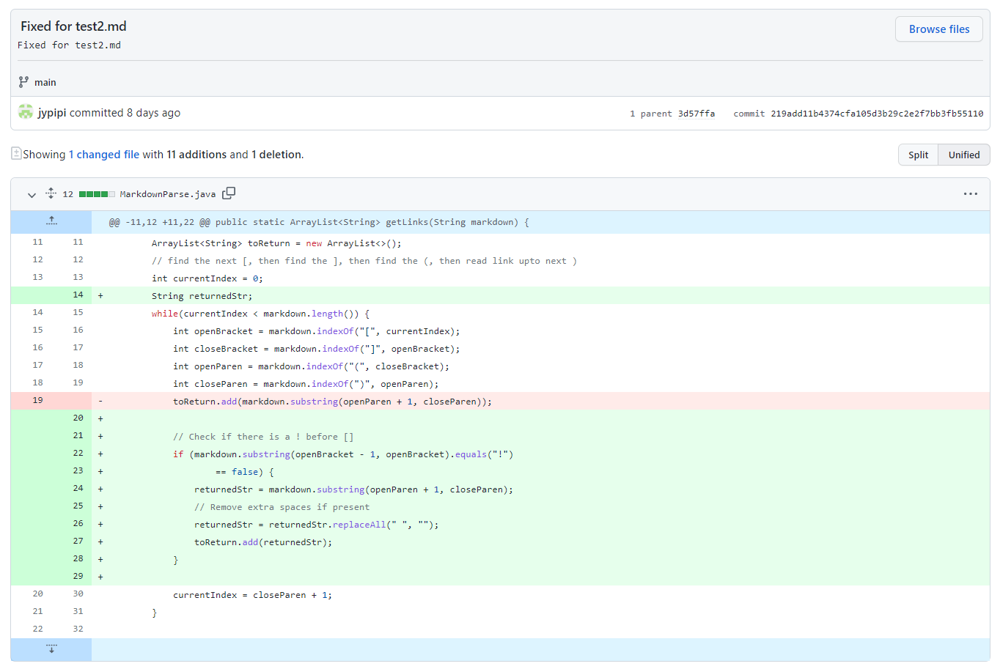
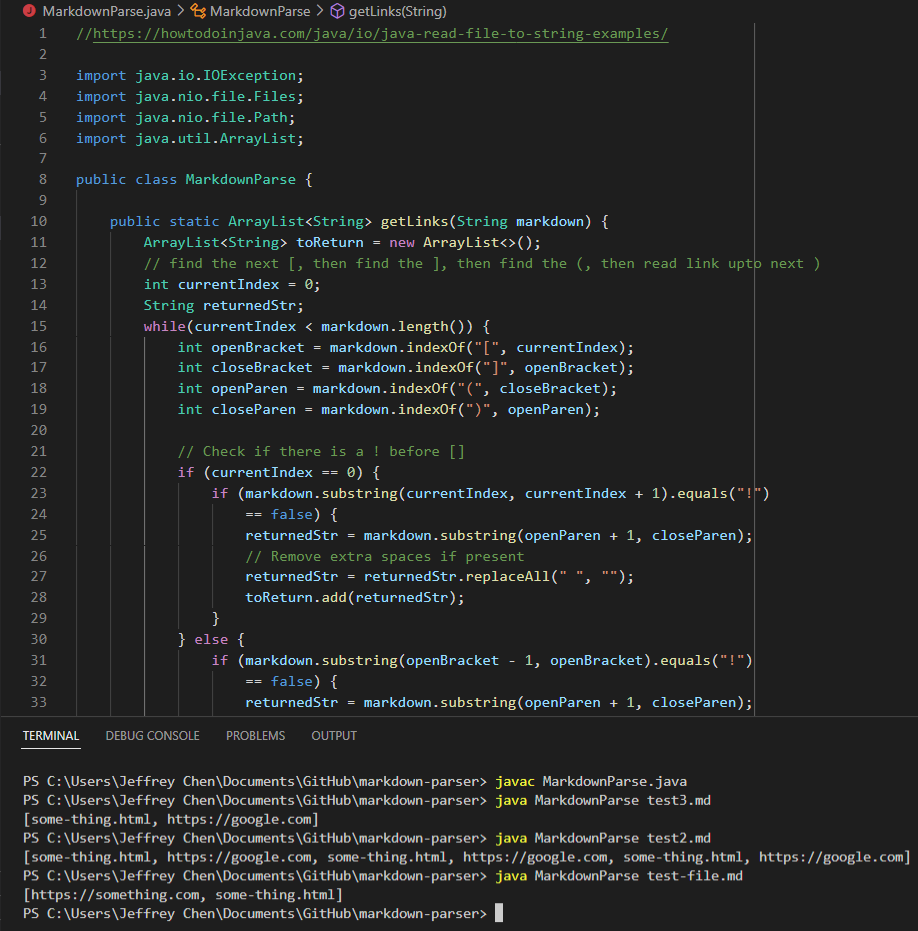

# Week 4: Lab Report 2

## Testing and Debugging

Hello there!

This lab report will focus on testing and debugging a program via incremental development and test-driven development (TDD).

In this case, we'll get started with a program called Markdown Parse in which a java file reads a markdown file and detects the URL links in it. Finally, it returns a list containing those links. For example, if a file contains `some-thing.html` and `https://google.com`, the program would output an ArrayList like this:

```
[some-thing.html, https://google.com]
```

In the following sections, we'll show *three* codes changes made in Lab 3 to fix different bugs.

Come on, let's go!

## Preparation

To get started, we need to fork the original repository of this program:

```
# Original Repository
$ https://github.com/nidhidhamnani/markdown-parser

# My Repository for this program
$ https://github.com/jypipi/markdown-parser.git
```

Next, clone the forked repository via Github Desktop, and open it in Visual Studio Code:


## Breaking Test One

[Link to Test-1 File](https://github.com/jypipi/markdown-parser/blob/main/test2.md)

In the first test, these conditions were checked:

1) Links at the same line --- ***Passed***

2) Empty lines exist between two links --- ***Passed***

3) Redundant spaces within parentheses containing a link --- ***Failed***

- Symptom: two spaces are printed at both ends of the link.

4) Image inference --- ***Failed***

- Symptom (Logic error): print out the image directory.

```
# Input for Condition 3
[link5]( some-thing.html )

# Input for Condition 4


# Outputs for Condition 3 and 4
[..., some-thing.html , Image inserted here, ...]
```

* Screenshot of Incorrect Outputs:


* Debugging ([Code Changes](https://github.com/jypipi/markdown-parser/commit/219add11b4374cfa105d3b29c2e2f7bb3fb55110)):

1) Added an if statement to check if a "!" exists before [].

2) Remove extra spaces in the string containing a link.




* Outputs after Debugging:


* Discussion:

In this test, the failure-inducing inputs were "extra spaces at both ends of a link" and "insertion of images", which caused symptoms, respectively: 1) the links with spaces were returned; 2) image directories were returned.

One of the bugs leading to these symptoms was that the original code did not check if the link inside the () is an URL or an image directory. In addition, another bug was that the original code did not check if any redundant space exists within (). Thus, basically, it printed out whatever in a () that is after [].

## Breaking Test Two

[Link to Test-2 File](https://github.com/jypipi/markdown-parser/blob/main/test3.md)

AS for the second test, these conditions were checked:

1) The file starts with a link --- ***Failed***

- Symptom: String index out of bound

2) Brackets and parentheses far apart in the file --- ***Passed***

```
# Input for Condition 1
[link1](some-thing.html)

# Input for Condition 2
[link2]                      


(https://google.com)

# Outputs for Condition 1 (Run-time error: index out of bound)

"Exception in thread "main" java.lang.StringIndexOutOfBoundsException: begin -1, end 0, length 227 at MarkdownParse.main(MarkdownParse.java:40)"

# Outputs for Condition 2 (Works)
[https://google.com]
```

* Screenshot of Inputs and Incorrect Outputs:


* Debugging ([Code Changes](https://github.com/jypipi/markdown-parser/commit/19b2f41c30fd56e76afb803eb30f00cd0c4b2aa1)):

- Added an if-else statement to check if currentIndex == 0.
    * If at the beginning of the file (currentIndex == 0), 
      check if there's a "!" at substring(0, 1);
    * Else, check if there's a "!" before the open bracket.


* Outputs after Debugging:



* Discussion:

As for this test, the failure-inducing input was putting an URL (including [] and ()) at the very beginning of the md file, which caused the symptom: string index out of bound. It occurred because the code extracted a substring representing an URL from index "openBracket - 1" to index "openBracket".

In this case, since the open bracket of the above failure-inducing input is at 0, the bug caused "openBracket - 1" to become negative in this situation. Therefore, if a file started with a link, it would lead to a run-time error and the failure to check if a "!" existed before the open bracket.

## Breaking Test Three

[Link to Test-3 File](https://github.com/jypipi/markdown-parser/blob/main/test4.md)

For the third test, this conditions was checked:

1) No link in a pair of parentheses --- ***Failed***

- Symptom: return an empty string

```
# Input for Condition 1
[link1]()

[link2]()

[link3](some-thing.html)

[link4]()

# Outputs for Condition 1 (Logic error: return empty strings)
[, , some-thing.html, ]
```

* Screenshot of Incorrect Outputs:


* Debugging ([Code Changes](https://github.com/jypipi/markdown-parser/commit/80fc94ed26e722aeb62b99d93ec19eb15c15c260)):

1) Added two int variables, start and end, to store the indices used to check if there's a "!" before the open bracket (Simplified the codes).

2) Added an if statement to check if the substring in the parentheses is empty. If so, the program skips returning any string and moves on.


* Outputs after Debugging:


* Discussion:

As for the last test, the failure-inducing input was that no link existed in a pair of parentheses following a pair of brackets. It caused the symptom: printing out empty strings. That was because the bug by which the program did not check if any returned string was empty. Thus, it would consider empty URL strings legal and return it.

# Conclusion

These are the three code changes that were done in lab 3 for the following conditions:

1) Print out extra spaces

2) Image inference

3) A file that starts with a link

4) Empty strings within parentheses

These experiences reveal how a program is improved by testing and checking. This lab goes through the process of error identification and debugging, which is essential to future programming work. Understanding its advantages, we'll be able to achieve more goals and have more fun when coding. Hope this report helps!

> [Return to main page](https://jypipi.github.io/cse15l-lab-reports/index.html)
