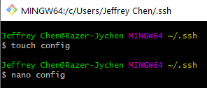
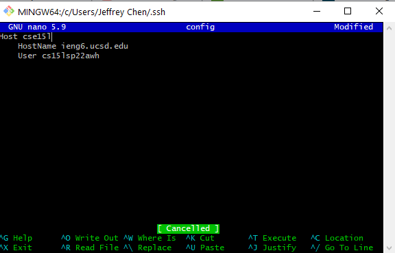
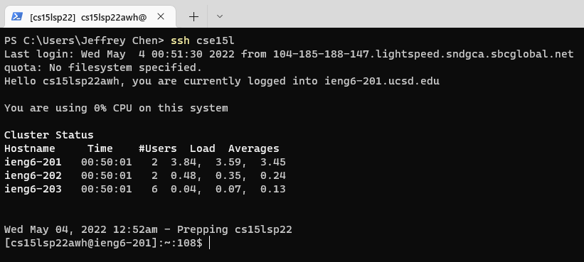
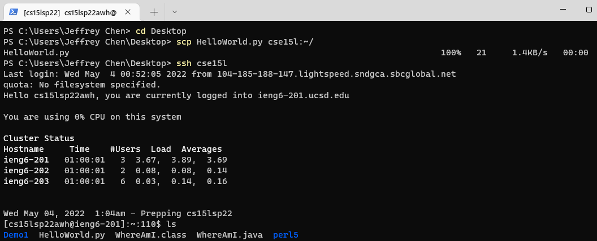
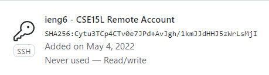
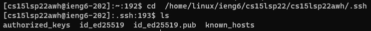
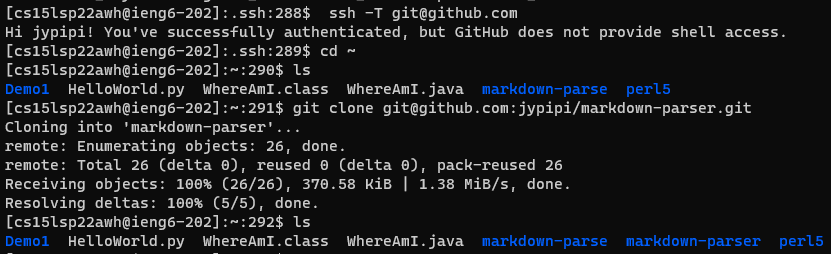
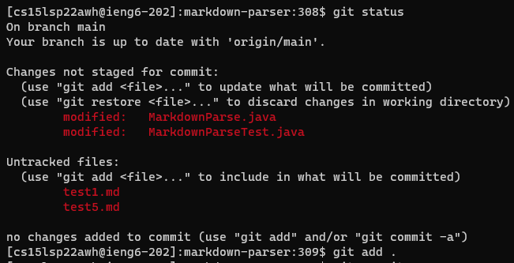
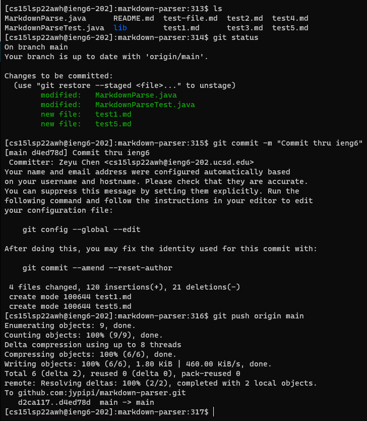

# Week 6: Lab Report 3

## Efficiency Improvement in Remote Server (ieng6)

Hi there!

This lab report will focus on improving our working efficiency by 1) streamlining ssh Configuration, 2) setting up Github access from ieng6, and 3) copying whole directories with scp -r to this remote server. In these ways, we'll be able to take advantage of the Linux-based remote system and lift our efficiency when working on both local and remote environments at the same time.

In this lab, we'll continue with the Markdown Parse program in which a java file reads a markdown file and detects the URL links in it. 

## Streamline ssh Configuration

Although we've already simplified the procedures for ssh into our ieng6 accounts without entering password, typing the user and host names before login is still time-consuming, which also means we have to always remember those figures correctly.

Why not attempting to be "lazy"? In other words, we can **create a config file** to help us "remember" them.

First, open a terminal (in my case, I used Git Bash):

```
# Go to the directory /.ssh
cd ~/.ssh

# Create the file
$ touch config

# Open this file
$ nano config
```



In the config file, add the following content:

```
Host <customized alias>
    HostName ieng6.ucsd.edu
    User cs15lsp22xxx
```



Then, save and exit the file.

Let's try:

```
# In general
ssh <customized alias>

# In my case, my alias is "cse15l"
ssh cse15l
```



Now we try to copy a file from my local machine to remote account using scp and my alias:

```
# Copy HelloWorld.py to ieng6
$ scp HelloWorld.py cse15l:~/
```



That's it!

Now we can log into our remote accounts and run commands using our aliases directly!

## Set up Github Access from ieng6

To push our codes from ieng6 to GitHub, we need to utilize SSH keys to build the connection between these two platforms.

```
# First, let's generate a new SSH key in a terminal:
$ ssh-keygen -t ed25519 -C "<Your email for GitHub account>"

# Adding your SSH key to the ssh-agent:
$ eval "$(ssh-agent -s)"
$ ssh-add ~/.ssh/id_ed25519

# Copy the SSH public key to clipboard
$ cat ~/.ssh/id_ed25519.pub

# Finally, click on "Add SSH key" in "Settings" on GitHub
# and paste the public key to the "Key" field.
```

Here're what I got after the above operations:



<p align="center">

*Figure 1*: The public key stored on GitHub.

</p>



*Figure 2*: The public and private keys stored in my ieng6 account.

Now let's try to commit and push a change to GitHub in my remote server:

```
# test my SSH connection
$ ssh -T git@github.com

# clone my repository to my ieng6 account
$ git clone git@github.com:jypipi/markdown-parser.git

# After making changes, start to send updates to GitHub:

# add updates to staging area
$ git add .
$ git status

# commit and push
$ git commit -m "Commit thru ieng6"
$ git push origin main
```

* Screenshots of my steps to push my updates to GitHub in remote server







* Here's the link for the resulting commit:

[Here to check the commit](https://github.com/jypipi/markdown-parser/commit/d4ed78d6c33ad4670682da88c537b15ab3b0efeb)

## Copy Whole Directories with scp -r

```
# Copy necessary files, compile and run a test via one command

$ scp -r *.java *.md lib/ cse15l:markdown-parse; ssh cse15l \
  "cd markdown-parse; \
   /software/CSE/oracle-java-17/jdk-17.0.1/bin/javac -cp .:lib/junit-4.13.2.jar:lib/hamcrest-core-1.3.jar MarkdownParseTest.java; \
   /software/CSE/oracle-java-17/jdk-17.0.1/bin/java -cp .:lib/junit-4.13.2.jar:lib/hamcrest-core-1.3.jar org.junit.runner.JUnitCore MarkdownParseTest \
  "
```
