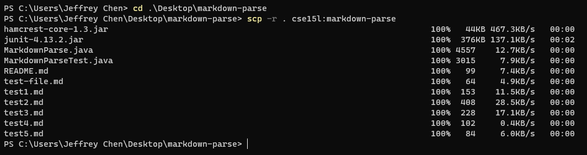
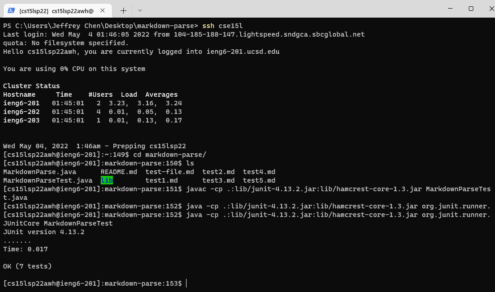
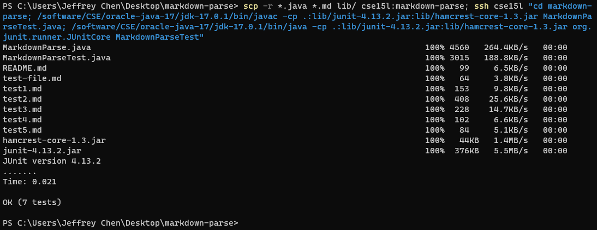
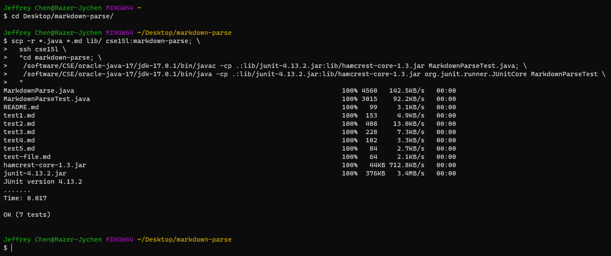

# Week 6: Lab Report 3

## Functions for Efficiency Improvement

Hi there!

In this lab report, we will focus on improving our working efficiency by 1) streamlining SSH configuration, 2) setting up GitHub access from ieng6, and 3) copying whole directories with scp -r to this remote server. In these ways, we'll be able to take advantage of the Linux-based remote system and lift our efficiency when working on both local and remote environments at the same time.

For this lab, we continue with the Markdown Parse program in which a java file reads a markdown file and detects the URL links in it. 

## Streamline SSH Configuration

Although we've already simplified the procedures for SSH into our ieng6 accounts without entering password, typing the user and host names for login is still time-consuming, which also means we have to always remember those figures correctly.

Why not attempting to be "lazy"? For example, we can **create a config file** to help us "remember" them.

First, open a terminal:

```
# Go to the directory /.ssh
cd ~/.ssh

# Create the file
$ touch config

# Open this file
$ nano config
```

 In my case, I used Git Bash:


In the config file, add the following content:

```
Host <customized alias>
    HostName ieng6.ucsd.edu
    User cs15lsp22xxx
```


Then, save and exit the file.

Let's try:

```
# In general
ssh <customized alias>

# In my case, my alias is "cse15l"
ssh cse15l
```


Now we try to copy a file from my local machine to the remote account with scp and my alias:

```
# Copy HelloWorld.py to ieng6
$ scp HelloWorld.py cse15l:~/
```


That's it!

Now we can log into our remote accounts and run commands using our aliases directly!

## Set up Github Access from Remote Server (ieng6)

To push our codes from ieng6 to GitHub, we need to utilize SSH keys to build the connection between these two platforms.

```
# First, let's generate a new SSH key in a terminal:
$ ssh-keygen -t ed25519 -C "<Your email for GitHub account>"

# Adding your SSH key to the ssh-agent:
$ eval "$(ssh-agent -s)"
$ ssh-add ~/.ssh/id_ed25519

# Copy the SSH public key to clipboard
$ cat ~/.ssh/id_ed25519.pub

# Finally, click on "Add SSH key" in "Settings" on GitHub
# and paste the public key to the "Key" field.
```

Here're what I got after the above operations:

<p align="center">

  

</p>

<p align="center">

Figure 1: The public key stored on GitHub.

</p>

<p align="center">

  

</p>

<p align="center">

Figure 2: The public and private keys stored in my remote account.

</p>

* Commit and Push via git Commands

Now let's try to commit and push a change to GitHub on remote server:

```
# test my SSH connection
$ ssh -T git@github.com

# clone my repository to my ieng6 account
$ git clone git@github.com:jypipi/markdown-parser.git

# After making changes, start to send updates to GitHub:

# add updates to staging area
$ git add .
$ git status

# commit and push
$ git commit -m "Commit thru ieng6"
$ git push origin main
```

* Screenshots of my steps to push my updates to GitHub on remote server


* The link for the resulting commit:

[Here to check the commit](https://github.com/jypipi/markdown-parser/commit/d4ed78d6c33ad4670682da88c537b15ab3b0efeb)

## Copy Whole Directories with scp -r

Duplicating the whole working directory with one command can also greatly improve our efficiency. In this case, `scp -r` enables us to copy files recursively.

> Copy the whole markdown-parse directory to the remote server

```
$ scp -r . cse15l:markdown-parse
```



> Compile and run the tests on remote server after copying

```
# Log in to ieng6 account and go to the directory
$ ssh cse15l
$ cd markdown-parse

# Compile and run the JUnit test file

$ javac -cp .:lib/junit-4.13.2.jar:lib/hamcrest-core-1.3.jar MarkdownParseTest.java

$ java -cp .:lib/junit-4.13.2.jar:lib/hamcrest-core-1.3.jar org.junit.runner.JUnitCore MarkdownParseTest
```



> Complete the above operations in one line

```
$ scp -r *.java *.md lib/ cse15l:markdown-parse; \
  ssh cse15l \
  "cd markdown-parse; \
   /software/CSE/oracle-java-17/jdk-17.0.1/bin/javac -cp .:lib/junit-4.13.2.jar:lib/hamcrest-core-1.3.jar MarkdownParseTest.java; \
   /software/CSE/oracle-java-17/jdk-17.0.1/bin/java -cp .:lib/junit-4.13.2.jar:lib/hamcrest-core-1.3.jar org.junit.runner.JUnitCore MarkdownParseTest \
  "
```

In PowerShell:



In Git Bash:



# Conclusion

Today, we covered three topics related to improving efficiency when we are working on both our local machines and remote server ieng6:

1) Streamlining SSH Configuration

2) Setup GitHub Access from ieng 6

3) Copying the Whole Directory via `scp -r` Command

Efficiency is gold! Taking advantage of the above functions, we will be able to complete tasks such as coding and debugging on local machines and the remote server more quickly and smoothly. That's all, see you next time!

> [Return to Main Page](https://jypipi.github.io/cse15l-lab-reports/index.html)
